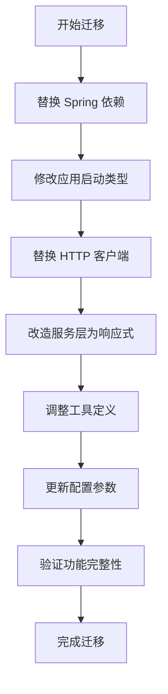
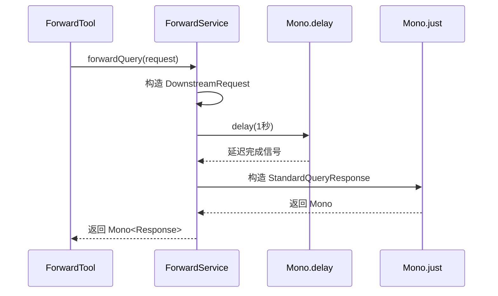
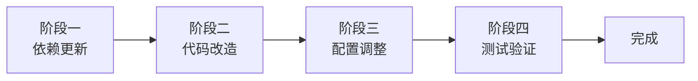

# MCP Server 从 WebMVC 迁移至 WebFlux 模式设计方案

## 一、迁移目标

将 MCP Server 从同步阻塞的 WebMVC 模式迁移至响应式非阻塞的 WebFlux 模式，以提升系统并发处理能力和资源利用率，同时保持现有功能特性不变。

## 二、现状分析

### 2.1 当前架构特征

| 维度 | 当前状态 | 特征说明 |
|------|---------|---------|
| Web 容器 | Tomcat（Servlet 容器） | 基于线程池的同步阻塞模型 |
| 应用类型 | WebApplicationType.SERVLET | Spring MVC 模式 |
| MCP Server 框架 | spring-ai-starter-mcp-server-webmvc | 同步 MCP Server 实现 |
| HTTP 客户端 | RestTemplate | 阻塞式 HTTP 调用 |
| 服务模式 | SYNC（同步模式） | 工具调用为阻塞式处理 |
| 处理方式 | Thread.sleep() 模拟延迟 | 线程阻塞式等待 |

### 2.2 核心组件识别

| 组件名称 | 文件路径 | 需要变更 |
|---------|---------|---------|
| 应用入口 | McpServerApplication.java | 是 - 修改应用类型 |
| 构建配置 | build.gradle | 是 - 替换依赖项 |
| MCP 配置 | application.properties | 是 - 调整服务模式 |
| HTTP 客户端配置 | WebClientConfig.java | 是 - 替换为 WebClient |
| 转发服务 | ForwardService.java | 是 - 改造为响应式 |
| 工具定义 | ForwardTool.java | 是 - 支持 Mono 返回 |
| 配置属性 | DownstreamProperties.java | 否 - 保持不变 |

### 2.3 技术栈差异对比

| 技术层面 | WebMVC（当前） | WebFlux（目标） |
|---------|---------------|----------------|
| 编程模型 | 命令式（Imperative） | 声明式（Reactive） |
| I/O 模型 | 同步阻塞 | 异步非阻塞 |
| 线程模型 | 每请求一线程 | 事件循环 + 少量工作线程 |
| Web 容器 | Tomcat/Jetty | Netty（默认） |
| 返回类型 | POJO 对象 | Mono/Flux 响应式流 |
| 背压支持 | 无 | 原生支持 |

## 三、迁移方案设计

### 3.1 迁移架构流程

### 3.2 核心变更策略

#### 3.2.1 依赖替换策略

| 原依赖项 | 目标依赖项 | 变更原因 |
|---------|-----------|---------|
| spring-boot-starter-web | spring-boot-starter-webflux | 启用响应式 Web 栈 |
| spring-ai-starter-mcp-server-webmvc | spring-ai-starter-mcp-server-webflux | 支持异步 MCP Server |
| RestTemplate（代码层） | WebClient（代码层） | 响应式 HTTP 客户端 |

#### 3.2.2 应用类型调整策略

**启动配置变更：**
- 当前设置：`app.setWebApplicationType(WebApplicationType.SERVLET)`
- 目标设置：`app.setWebApplicationType(WebApplicationType.REACTIVE)`

**容器切换逻辑：**
- 移除 Tomcat 依赖自动引入
- 启用 Netty 作为默认响应式容器
- 无需显式配置，Spring Boot 自动装配

#### 3.2.3 HTTP 客户端改造策略

**WebClient 配置设计：**

| 配置项 | 配置值 | 说明 |
|-------|-------|------|
| 连接超时 | 5 秒 | 保持与原 RestTemplate 一致 |
| 读取超时 | 30 秒 | 保持与原 RestTemplate 一致 |
| 基础 URL | 从 DownstreamProperties 读取 | 动态配置下游地址 |
| 默认请求头 | User-Agent: {appName}/1.0 | 保持原有行为 |
| 连接池 | 默认值 | 使用 Reactor Netty 默认配置 |

**配置类重构目标：**
- 移除 `RestTemplate` Bean 定义
- 新增 `WebClient` Bean 定义
- 注入 `DownstreamProperties` 用于基础配置
- 使用 `WebClient.Builder` 构建器模式配置超时和拦截器

#### 3.2.4 服务层响应式改造策略

**ForwardService 改造要点：**

| 改造维度 | 当前实现 | 目标实现 |
|---------|---------|---------|
| 方法签名 | `StandardQueryResponse forwardQuery(...)` | `Mono<StandardQueryResponse> forwardQuery(...)` |
| 阻塞操作 | `Thread.sleep(1000)` | `Mono.delay(Duration.ofSeconds(1))` |
| 数据转换 | 直接对象赋值 | 使用 `Mono.just()` 和 `map()` 操作符 |
| 异常处理 | try-catch 捕获 | `onErrorResume()` 响应式错误处理 |

**处理流程设计：**

#### 3.2.5 工具层适配策略

**ForwardTool 改造目标：**
- 方法返回类型从 `StandardQueryResponse` 变更为 `Mono<StandardQueryResponse>`
- 保持 `@Tool` 注解不变
- 调用 ForwardService 时无需显式订阅（框架自动处理）
- 异常处理委托给 Service 层的响应式错误处理

**工具注册方式：**
- 保持 `MethodToolCallbackProvider` 构建方式不变
- Spring AI MCP Server WebFlux 框架自动识别 Mono 返回类型

### 3.3 配置参数调整

#### 3.3.1 application.properties 变更表

| 配置项 | 当前值 | 目标值 | 变更原因 |
|-------|-------|-------|---------|
| spring.ai.mcp.server.name | webmvc-mcp-server | webflux-mcp-server | 反映架构变化 |
| spring.ai.mcp.server.type | SYNC | ASYNC | 启用异步响应式模式 |

#### 3.3.2 保持不变的配置

以下配置在迁移过程中保持不变：
- SSE 端点路径：`/mcp/messages`
- 工具能力标志：`spring.ai.mcp.server.capabilities.tool=true`
- 下游服务配置：`downstream.*` 相关所有配置
- 日志级别配置

## 四、迁移影响分析

### 4.1 功能兼容性

| 功能模块 | 影响程度 | 说明 |
|---------|---------|------|
| MCP 工具调用 | 无影响 | 框架层面透明支持 |
| SSE 流式端点 | 无影响 | WebFlux 原生支持 SSE |
| 下游服务转发 | 无影响 | 功能逻辑保持一致 |
| 配置属性注入 | 无影响 | Spring Boot 统一配置机制 |

### 4.2 性能预期变化

| 性能指标 | 预期变化 | 原因分析 |
|---------|---------|---------|
| 并发处理能力 | 显著提升 | 非阻塞 I/O 减少线程阻塞 |
| 内存占用 | 降低 | 减少线程数量 |
| 响应延迟 | 基本持平 | 单次请求延迟无显著差异 |
| 吞吐量 | 提升 | 高并发场景下资源利用率更高 |

### 4.3 风险识别

| 风险项 | 风险等级 | 缓解措施 |
|-------|---------|---------|
| 响应式编程理解曲线 | 低 | 业务逻辑简单，改造范围可控 |
| 第三方库兼容性 | 低 | 仅依赖 Spring 官方库 |
| 调试复杂度增加 | 中 | 使用 Reactor 调试工具和日志链路追踪 |

## 五、验证策略

### 5.1 功能验证清单

| 验证项 | 验证方法 | 预期结果 |
|-------|---------|---------|
| 服务启动 | 启动应用并检查日志 | 成功启动，无错误日志 |
| SSE 端点可达性 | 使用 curl 或客户端连接 `/mcp/messages` | 成功建立 SSE 连接 |
| 工具调用响应 | 发送标准查询请求 | 返回正确的 StandardQueryResponse |
| 延迟处理 | 测量响应时间 | 约 1 秒延迟符合预期 |
| 异常场景 | 模拟下游服务不可用 | 正确返回错误信息 |

### 5.2 性能验证方案

**并发测试场景设计：**

| 测试场景 | 并发数 | 持续时间 | 观察指标 |
|---------|-------|---------|---------|
| 基准性能 | 10 | 1 分钟 | 平均响应时间、成功率 |
| 中等负载 | 50 | 3 分钟 | 吞吐量、CPU/内存占用 |
| 高负载 | 200 | 5 分钟 | 系统稳定性、错误率 |

**对比基准：**
- 迁移前 WebMVC 模式作为性能基线
- 重点关注高并发场景下的资源消耗和响应稳定性

## 六、实施步骤

### 6.1 实施阶段划分

### 6.2 详细实施步骤

| 阶段 | 步骤编号 | 操作内容 | 涉及文件 |
|------|---------|---------|---------|
| 阶段一 | 1.1 | 更新 build.gradle 依赖项 | server/build.gradle |
| 阶段二 | 2.1 | 修改 McpServerApplication 应用类型 | McpServerApplication.java |
| 阶段二 | 2.2 | 重构 WebClientConfig 使用 WebClient | WebClientConfig.java |
| 阶段二 | 2.3 | 改造 ForwardService 为响应式 | ForwardService.java |
| 阶段二 | 2.4 | 调整 ForwardTool 返回类型 | ForwardTool.java |
| 阶段三 | 3.1 | 更新 application.properties 配置 | application.properties |
| 阶段四 | 4.1 | 执行功能验证 | - |
| 阶段四 | 4.2 | 执行性能验证 | - |

### 6.3 关键实施要点

**依赖更新注意事项：**
- 移除 `spring-boot-starter-web` 依赖
- 添加 `spring-boot-starter-webflux` 依赖
- 替换 `spring-ai-starter-mcp-server-webmvc` 为 `spring-ai-starter-mcp-server-webflux`
- 保持版本号 `1.0.2` 不变（假设 WebFlux 版本与 WebMVC 版本一致）

**代码改造原则：**
- 遵循响应式编程范式，避免在响应式链中使用阻塞操作
- 使用 `Mono.delay()` 替代 `Thread.sleep()`
- 保持日志输出点位置不变，便于对比验证
- 错误处理使用响应式操作符，避免传统 try-catch

**配置调整原则：**
- 最小化配置变更范围
- 保持向后兼容性（如端点路径）
- 清晰标识架构变化（如服务名称）

## 七、回滚方案

### 7.1 回滚触发条件

| 条件 | 严重性 | 是否回滚 |
|------|-------|---------|
| 服务无法启动 | 高 | 是 |
| 功能验证失败 | 高 | 是 |
| 性能严重退化（>50%） | 高 | 是 |
| 次要功能异常 | 低 | 否，修复后继续 |

### 7.2 回滚操作步骤

| 步骤 | 操作 | 说明 |
|------|------|------|
| 1 | 恢复 build.gradle 至原依赖配置 | 使用版本控制系统回退 |
| 2 | 恢复所有 Java 源文件 | 使用版本控制系统回退 |
| 3 | 恢复 application.properties | 使用版本控制系统回退 |
| 4 | 重新构建项目 | 执行 `./gradlew clean build` |
| 5 | 启动服务并验证 | 确认回退后功能正常 |

## 八、总结

本设计方案提供了从 WebMVC 到 WebFlux 的完整迁移路径，核心变更涵盖依赖替换、应用类型调整、HTTP 客户端改造、服务层响应式重构和工具层适配五大方面。迁移后将显著提升系统在高并发场景下的处理能力和资源利用效率，同时保持功能完整性和配置兼容性。通过清晰的验证策略和回滚方案，确保迁移过程可控、可回退。
